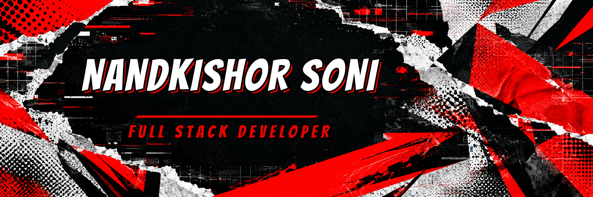
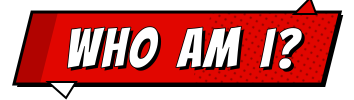
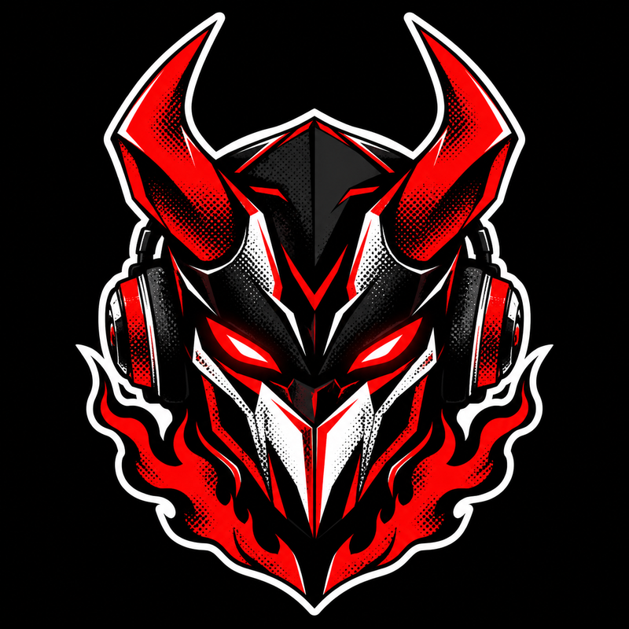
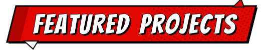
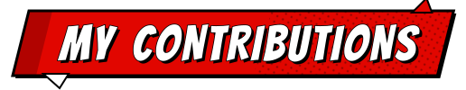
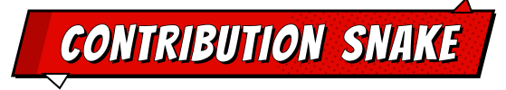
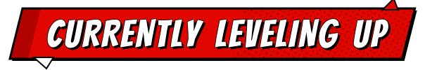
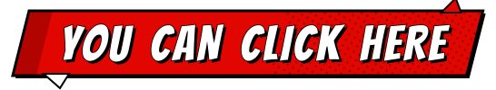

<!-- GitHub Profile README — @legendxdevil | Red x Black edition -->

<div align="center">




<br/>


</div>

<br/>

<p align="center"></p>

<p align="center">
  <i>I build the kind of software that disappears into the background — fast, polished, and quietly doing exactly what it's supposed to.</i>
</p>

<table align="center">
<tr>
<td width="34%" align="center" valign="middle">
  
</td>
<td valign="middle">

B.Tech CSE student at **HMR ITM, Delhi** and a **full-stack developer** who moves comfortably between **mobile and web** — Flutter apps on one side, Next.js / React products on the other.

I care about the details most people skip: the 200ms animation that makes a screen feel premium, the architecture decision that saves a refactor six months later.

🔭 Right now I'm deep in **real-time systems** and **AI-assisted product design**.

</td>
</tr>
</table>

<br/>

```yaml
role: Full Stack Developer (Mobile + Web)
stack: [Flutter, Next.js, React, TypeScript, Node.js, Firebase]
focus: Real-time Systems · Premium UI/UX · AI-Integrated Products
portfolio: "https://portfolio-2026-theta-steel.vercel.app"
currently_building: "SeismicRail Command — Railway Emergency Control Dashboard"
also_exploring: "Liquid Glass design language for a Flutter music player"
collaboration: "Open to full-stack & mobile collabs, hackathons, and OSS"
fun_fact: "I'll refactor a working feature three times just to make the animation smoother 🎨"
```

<br/>

> [!CAUTION]
> Code that works is the baseline. Code that feels good to use is the actual job.
>
> What you see here is built with practice, curiosity, and persistence.

<br/>

<p align="center"></p>

<table>
<tr>
<td width="50%" valign="top">

### 📱 Mobile Engineering
Flutter apps with native-feeling polish — BLoC architecture, custom shaders, animated gradients reacting to live data, and system-level integrations (overlays, background services).

</td>
<td width="50%" valign="top">

### 🌐 Web Engineering
Next.js 14 + TypeScript products with Framer Motion micro-interactions, Firebase backends, and e-commerce flows built for real-world payment systems like UPI.

</td>
</tr>
</table>

<br/>

<p align="center"></p>

<table>
  <tr>
    <td width="50%">
      <h3>🚂 SeismicRail Command</h3>
      <p>Enterprise railway emergency control dashboard — real-time WebSocket data, MapLibre live tracking, and a canvas-based hero animation.</p>
      <p>
        
        
        
        
      </p>
    </td>
    <td width="50%">
      <h3>💎 Smiiaone</h3>
      <p>Full-featured jewellery & skincare e-commerce platform with manual UPI + WhatsApp checkout flow and a fully scoped PRD.</p>
      <p>
        
        
        
      </p>
    </td>
  </tr>
  <tr>
    <td width="50%">
      <h3>🎵 Liquid Glass Music Player</h3>
      <p>Apple-inspired Flutter music player — animated mesh gradients driven by album art colors, custom visualizers, immersive UI.</p>
      <p>
        
        
        
      </p>
    </td>
    <td width="50%">
      <h3>🤖 Career AI — Resume Analyzer</h3>
      <p>AI-powered resume analyzer using NLP for intelligent feedback, skill gap detection, and role matching.</p>
      <p>
        
        
        
      </p>
    </td>
  </tr>
</table>

<details>
<summary><b>📦 More projects</b></summary>
<br/>

**📱 Student Hub** — Offline-first academic tracker · `Flutter` `BLoC` `SQLite` `GoRouter` `fl_chart`

**🎬 Android Overlay Widget** — Hidden floating video overlay with GLSL shader & reboot auto-start · `Flutter` `Android` `Custom Shaders`

**🎨 Personal Portfolio** — 3D tilt cards, magnetic buttons, parallax hero, horizontal scroll showcase · `Next.js` `Framer Motion` `Tailwind`

</details>

<br/>

<p align="center"></p>

<div align="center">

**Mobile & Frontend**
<br/>


**Backend, DB & Languages**
<br/>


**Tools & Platforms**
<br/>


</div>

<br/>

<p align="center"></p>

<div align="center">


<br/>


<br/>


</div>

<br/>

<p align="center"></p>

<p align="center">
  <picture>
    <source media="(prefers-color-scheme: dark)" srcset="https://raw.githubusercontent.com/legendxdevil/legendxdevil/output/snake-dark.svg" />
    <source media="(prefers-color-scheme: light)" srcset="https://raw.githubusercontent.com/legendxdevil/legendxdevil/output/snake-light.svg" />
    
  </picture>
</p>

<br/>

<p align="center"></p>

```diff
+ Liquid Glass design systems for Flutter
+ Real-time architecture with WebSockets at scale
+ AI-assisted game development pipelines (Godot exploration)
- Perfecting that one animation curve that never feels quite right 😅
```

<br/>

<p align="center"></p>

<div align="center">

<a href="https://portfolio-2026-theta-steel.vercel.app/" target="_blank">
  
</a>
<a href="https://www.linkedin.com/in/nand-kishore-soni-036783317/" target="_blank">
  
</a>
<a href="https://www.instagram.com/ig_nandkishore_soni" target="_blank">
  
</a>
<a href="https://x.com/x_nandkishore" target="_blank">
  
</a>
<a href="https://api.whatsapp.com/send/?phone=7982402954&text=Hi+Nandkishore%21+I+just+came+across+your+amazing+portfolio+and+would+love+to+connect.&type=phone_number&app_absent=0" target="_blank">
  
</a>
<a href="https://web.telegram.org/k/#@Tm_monarch" target="_blank">
  
</a>
<a href="https://www.skills.google/public_profiles/17fd8191-5307-48d9-b9cd-dcd29428e518" target="_blank">
  
</a>

<br/><br/>

💼 **Open for collaboration** on Full-Stack, Mobile, and AI-integrated projects
<br/>
⚡ Got a hackathon team or an idea worth shipping? Hit me up.

</div>

<br/>


<p align="center">
  <em>🌟 Crafted with passion by <strong>@legendxdevil</strong> · Keep Building, Keep Growing 💻</em>
</p>
